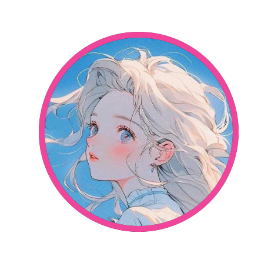

   

            
    

  
   
  

  

    Eu tinha um vscode e um sonho
  

  

  
<a href="https://www.instagram.com/klock_rc/" target="_blank">

  

  

 
<b>Visitors Count</b>
  

 
 

  

  
  

